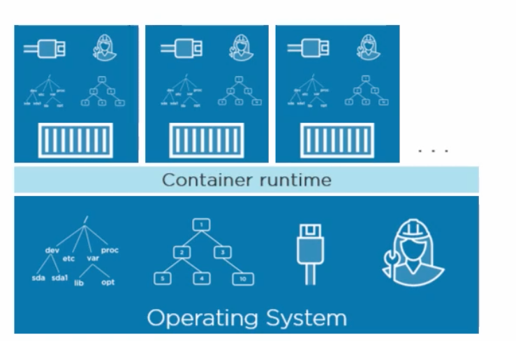
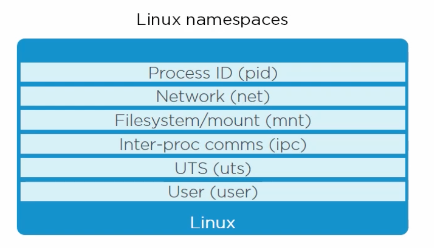
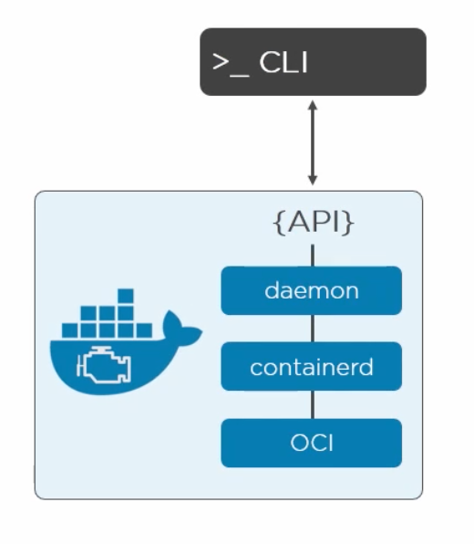

# Docker Deep-Dive
Isolated area of an OS with resource usage limits applied

## Namespaces
Is about isolation

### Linux Namespaces

## Control Groups
Grouping objects and setting limits

## Docker Engine

## Docker in linux

